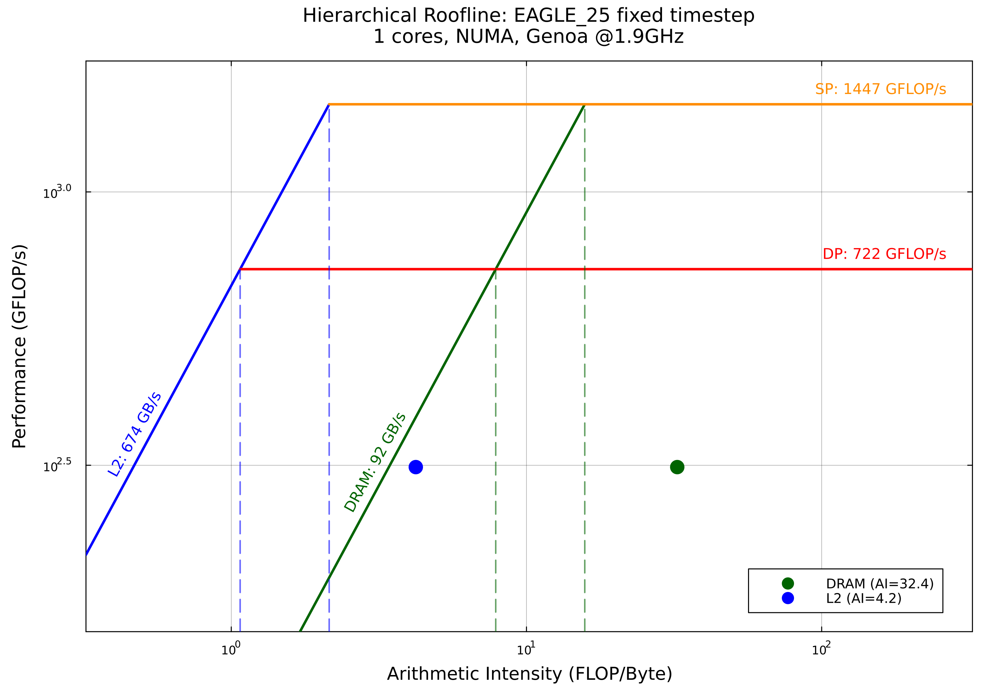
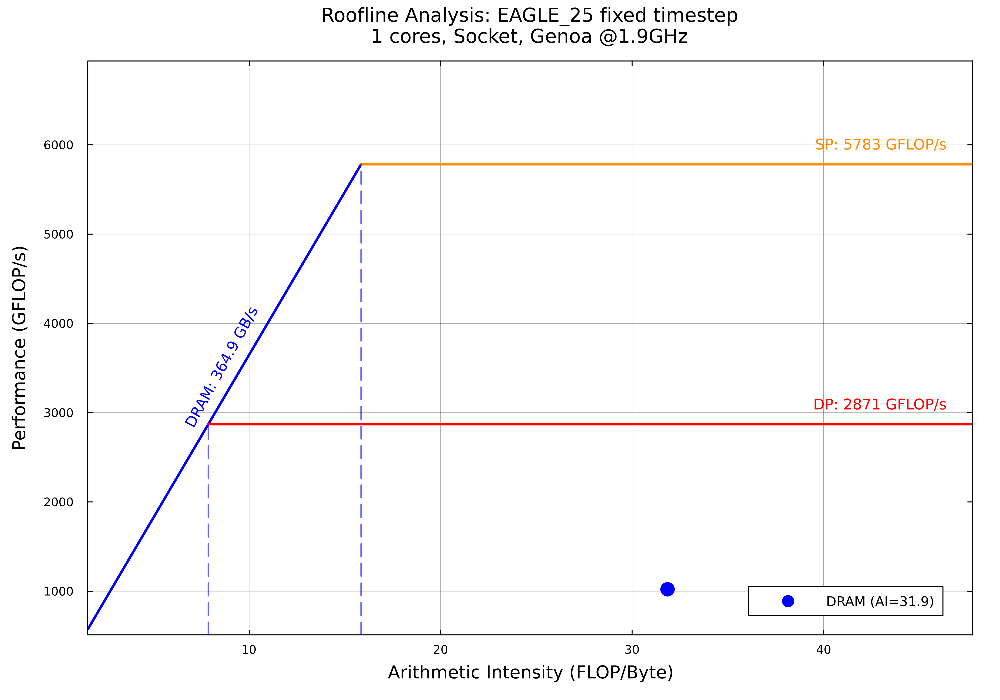
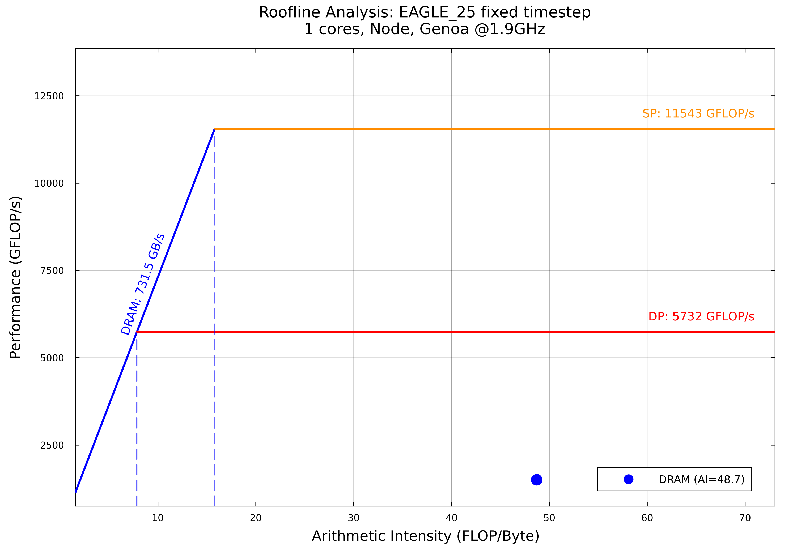

# DiRAC Days benchmarking with likwid walk-through

## Methodology overview

The general purpose of this walk-through is to share the methodology I used for benchmarking SWIFT (and later sphNG) with likwid in order to better understand specific characteristics of its performance.  

- SWIFT: Understand why SWIFT performs so well on CPUs, and help make decisions on future CPUs systems purchasing to benefit its characteristics;
- sphNG: Understand fine-grain optimisation gains during development (in addition to "standard" profilers);

For each of these, we care about different things, but the underlying methodology is similar.

### Methodology steps

1. Identify what measures are relevant for the code within the context (you do not always need to measure everything!)
2. Establish peak expectations of the hardware (with micro-benchmarks)
3. Benchmark the code
4. Interoperate the results through analysis and rooflines

### The roofline model

The roofline model helps to make sense of and interpret benchmarking results.  

The idea of the model is to show how many compute operations (normally FLOP/s) can be done for each unit of data read (normally Bytes), a ratio know as the Arithmetic Intensity. Then, using this measure, identify where it stacks compared to the achievable limits (peaks) of the architecture, what is the limiting factor(s) to gain more performance.  

[Examples](https://qiuip.github.io/RooflinePlots.jl/dev/examples)

## Understanding the hardware and its performance expectations

The first step to establish a performance model is to understand what to expect from the hardware.  

To do this, it is useful to first understand the hardware specification. For example, for Genoa, going over the white paper, release notes and other sources, we can establish a table and notes that summarise its key features (in the next section). This will help set micro-benchmarks to get the peak performance.  

We have started populating such tables in the [Benchmarking Resources](https://github.com/DiRAC-HPC/Benchmarking-Resources) repository.

Some useful tools here include `lscpu`, `likwid-topology`, `hwinfo` and `numactl --hardware`.

### Genoa Technical specifications

| Component                   | Per-Core          | Per-CCD (8 cores) | Per-NUMA (3 CCDs)          | Per-Socket (12 CCDs) | Node (2 Sockets) |
|-----------------------------|-------------------|-------------------|----------------------------|----------------------|------------------|
| Cores                       | 1                 | 8                 | 24                         | 96                   | 192              |
| L1 Cache                    | 32 KB I + 32 KB D | 512 KB total      | 1.5 MB                     | 3 MB                 | 6 MB             |
| L2 Cache                    | 1 MB              | 8 MB              | 24 MB                      | 96 MB                | 192 MB           |
| L3 Cache                    | —                 | 32 MB shared      | 96 MB (3 × 32 MB)          | 384 MB (12 × 32 MB)  | 768 MB           |
| Memory Channels (DDR5-4800) | —                 | —                 | 3 channels                 | 12 channels          | 24 channels      |
| NUMA Domains (NPS=4)        | —                 | —                 | 1 NUMA domain              | 4 NUMA domains       | 8 NUMA domains   |
| Topology Mapping            | —                 | 1 CCD             | 3 CCDs + 3 memory channels | 12 CCDs total        | 24 CCDs total    |

**Notes:**

- Base and boost clocks
  - PState-3: 2.4 GHz base, up to 3.7 GHz boost
  - PState-2: 1.9 GHz base, no boost
- Memory controllers reside in the I/O die; the CCD-to-memory affinity is determined by NUMA mapping
- In NPS=4 mode, each NUMA domain contains
  - 24 cores
  - 96 MB L3 cache
  - 3 DDR5 channels
- L3 cache is private per CCD and not shared across CCDs.
- L3 cache acts as a victim cache for L2, storing evicted lines but not fetching directly from DRAM (*).

## Micro-benchmarking

Now that the architecture is known, we can use micro-benchmarks to obtain the peak performance for different counters and groups for the specific architecture.

We will use `likwid-bench` as it fits the methodology for likwid, which is well suited for this purpose, especially as the benchmarking is all done with likwid. However, other micro-benchmarking suites exist as well and could be used too.

### Module selection on COSMA8

On COSMA8, `likwid` was installed only with  `intel_comp/2025.0.1` and `clang_comp/18.1.8arm`.
To use the intel compilers, run:

```bash
module load intel_comp/2025.0.1
module load compiler-rt tbb umf compiler mpi likwid
```

### Micro-benchmarking selection

First we need to find out which `likwid-bench` benchmarks exist on the particular system we want to run on.
On the node we want to use for benchmarking, run:

```bash
likwid-bench -a
```

This returns a very long list of benchmarks.  Depending on the metrics we want to extract, we need to select the correct benchmark. For example, to obtain the peak double precision flops on Genoa (which supports avx512), we use the `peakflops_avx512_fma` benchmark, and for the memory bandwidth we use `stream_mem`. We will go over each of the benchmarks used for Genoa one by one, discussing how to set the values to obtain the peaks further below.  

Due to the topology of modern CPU architecture, we can expect our applications to run differently on a single NUMA domain, a single socket and on the whole node in multi-socket nodes.
It is worth obtaining peaks for each of these, scaling up the micro-benchmark parameters accordingly.

### Using likwid-perfctr to monitor performance counters

While `likwid-bench` provides its own performance metrics, `likwid-perfctr` allows us to access hardware performance counters directly.
This gives us more detailed and architecture-specific metrics that help validate our benchmarks and understand the hardware behaviour.

`likwid-perfctr` works by using performance counter groups - predefined sets of hardware counters that measure specific aspects of performance.
Different CPU architectures support different performance groups, so the first step is to discover what's available on your system.

#### Discovering available performance groups

To see all available performance groups for your architecture:

```bash
likwid-perfctr -a
```

This will output a list of available groups. Common groups include:

- `CACHE` - Data cache miss rate/ratio
- `FLOPS_DP` - Double precision floating point operations
- `FLOPS_SP` - Single precision floating point operations
- `FLOPS_AVX` - AVX floating point operations (if supported)
- `MEM` - Memory bandwidth metrics
- `MEMREAD` - Memory read bandwidth
- `MEMWRITE` - Memory write bandwidth
- `L2` - L2 cache bandwidth in MBytes/s
- `L3` - L3 cache bandwidth in MBytes/s

For detailed information about what a specific group measures:

```bash
likwid-perfctr -H -g <group_name>
```

**likwid cavitate**

One frustrating aspect of `likwid-perfctr` is that groups are different between systems - sometimes due to differences in counters, and sometimes for no apparent reason.
For instance, on Sapphire Rapids `MEM` gives a breakdown of `MEMREAD` and `MEMWRITE` counters perseverate + their combined measures. On Genoa, only the separate groups exist.
On the other hand, `FLOPS_DP` and `FLOPS_SP` on Milan and Genoa (Zen3 and Zen4) are identical as the microarchitecture does not provide events to differentiate between single- and double-precision, yet this is not reflected in the group name.
It is **crucial** to check what the counters actually do on a specific architecture and to not expect the same group names to exist or behave the same!
When unsure, check the [groups' actual code on the GitHub repo](https://github.com/RRZE-HPC/likwid/tree/master/groups).

#### Using likwid-perfctr with micro-benchmarks

To use `likwid-perfctr` with `likwid-bench`, use the following pattern:

```bash
likwid-perfctr -C <core_list> -g <group_name> -m <command>
```

Where:

- `-C <core_list>` specifies which cores to monitor (e.g., `0-23` for cores 0 through 23)
- `-g <group_name>` specifies the performance counter group to use
- `-m` tells likwid-perfctr to use marker API (important for likwid-bench integration)
- `<command>` is the benchmark command to run

The output will include both the benchmark results and the hardware counter measurements, with hopefully not too large a difference between them, providing some verification that the benchmark is behaving as expected.

#### Controlling CPU frequency with cpupower

For reproducible benchmarking, controlling CPU frequency is essential. Unlike micro-benchmarks which can sustain maximum boost frequencies, real applications typically cannot maintain peak boost continuously. This leads to frequency throttling and run-to-run variation that makes benchmarking unreliable.

CPU frequency can be controlled using `cpupower`:

```bash
# Check current frequency settings and CPU performance behaviour
sudo cpupower frequency-info

# Set frequency limits
sudo cpupower frequency-set -d <min_freq> -u <max_freq> -f <fixed_freq>
```

The `frequency-info` command provides insights into the CPU's performance behaviour, including current frequencies, available PStates, and boost capabilities.

**Important caveat for boost behaviour**: On COSMA8 Genoa nodes (and likely some other systems), when boost is enabled (PState-3), setting any frequency still allows the CPU to boost up to the maximum (3.7 GHz on Genoa). To obtain truly fixed frequencies for benchmarking, it's necessary to switch to PState-2, which disables boost entirely and runs at the base frequency (1.9 GHz on Genoa).

This means you'll typically benchmark at two operating points:

- **PState-3**: Boost enabled, achieving maximum performance (~3.7 GHz)
- **PState-2**: Boost disabled, fixed base frequency (~1.9 GHz)

For application benchmarking, the boost-enabled results are often more representative of real-world performance, while fixed-frequency results are useful for understanding frequency scaling and isolating performance characteristics.
However, this makes using the boost peaks unrealistic for the achievable peak performance.
In such scenarios, it is better to linearly scale the peaks from the frequency they were obtained to the average frequency the code was ran at.

### Putting it all together

Lets go over the general considerations for FLOP/s, system memory (DRAM) bandwidth and Cache.  

All the results, alongside the full logs and a script to run them, are all found in the [Benchmarking Resources](https://github.com/DiRAC-HPC/Benchmarking-Resources) repository.

### Peak FLOP/s

The `peakflops` micro-benchmarks for AVX + FMA need to be set up so that they reach the actual limit of its peak performance.
To do that, it helps to understand what the theoretical peaks on the architecture while tuning the micro-benchmark.  

For AVX + FMA, the general theoretical formula is:

- cores × frequency × (fma_units × fma_ops) × (vector_size / dp_size)

To get close to such numbers, we cannot afford to be slowed down by memory, so ideally we set the problem size to fit well within the L2 Cache (per-core) Cache limits (testing with smaller counters, the results were unpredictable and often worse - likely due to skipped counters).  

It is also important to make sure that the NUMA domain, and their associated memory channels are pinned, which can be done with `numactl`.
Note that `likwid-pin` also works, and `likwid-bench` itself also pins the threads, but on multi-NUMA systems using `numactl` adds some peace of mind that nothing will leak from outside of the specific domain.

#### Peak DP AVX512 FMA FLOP/s (Genoa)

Starting with double precision FLOP/s and using what we know about Genoa (Zen4):

- AVX512 (512-bit) on Zen4 provides 1 FMA units/core
- cores × frequency × (2 × 1) × (512/64) = cores × frequency × 16

So if everything is set absolutely perfectly, we can expect to get the number of cores times the frequency times 16.
The L2 Cache size on Genoa is 1MB.  To be well with its limits, a size of 0.5MB is set for the micro-benchmarks.  

The likwid command (scaled for number of cores) are then:

``` bash
numactl --cpunodebind=0 --membind=0 likwid-perfctr -C 0-23 -g FLOPS_DP -m likwid-bench -t peakflops_avx512_fma -W N:12MB:24 -i 1000

numactl --cpunodebind=0-3 --membind=0-3 likwid-perfctr -C 0-95 -g FLOPS_DP -m likwid-bench -t peakflops_avx512_fma -W N:48:96 -i 1000

numactl --cpunodebind=0-7 --membind=0-7 likwid-perfctr -C 0-191 -g FLOPS_DP -m likwid-bench -t peakflops_avx512_fma -W N:96:192 -i 1000
```

**Results with boost frequency (PState-3):**

| Cores | NUMAs | Theoretical (GFLOP/s) | Measured (GFLOP/s) | % of Peak | Frequency (GHz) |
|-------|-------|-----------------------|--------------------|-----------|-----------------|
| 24    | 1     | 1420.8                | 1413.1             | 99.46     | 3.7             |
| 96    | 4     | 5683.2                | 5634.6             | 99.14     | 3.7             |
| 192   | 8     | 11366.4               | 11216.8            | 98.68     | 3.7             |

**Results with fixed frequency (PState-2):**

| Cores | NUMAs | Theoretical (GFLOP/s) | Measured (GFLOP/s) | % of Peak | Frequency (GHz) |
|-------|-------|-----------------------|--------------------|-----------|-----------------|
| 24    | 1     | 729.6                 | 722.3              | 99.00     | 1.9             |
| 96    | 4     | 2918.4                | 2871.3             | 98.39     | 1.9             |
| 192   | 8     | 5836.8                | 5732.4             | 98.21     | 1.9             |

#### Peak SP AVX512 FMA FLOP/s (Genoa)

Similarly with single precision FLOP/s:

- cores × frequency × (2 × 1) × (512/32) = cores × frequency × 32

So if everything is set absolutely perfectly, we can expect to get double the double-precision FLOP/s, i.e. the number of cores times the frequency times 32.
The same cache consideration is used, setting a size of 0.5MB per-core for the micro-benchmarks.

The likwid commands (scaled for number of cores) are then:

```bash
numactl --cpunodebind=0 --membind=0 likwid-perfctr -C 0-23 -g FLOPS_SP -m likwid-bench -t peakflops_sp_avx512_fma -W N:12MB:24 -i 1000

numactl --cpunodebind=0-3 --membind=0-3 likwid-perfctr -C 0-95 -g FLOPS_SP -m likwid-bench -t peakflops_sp_avx512_fma -W N:48:96 -i 1000

numactl --cpunodebind=0-7 --membind=0-7 likwid-perfctr -C 0-191 -g FLOPS_SP -m likwid-bench -t peakflops_sp_avx512_fma -W N:96:192 -i 1000
```

If no options for the output were given, `likwid-perfctr` produces a ASCII-table format output, which can be quite long and includes the raw counters output per-core and summarised with min / max values, and a human-readable output per-core and summarised with min / max values.
Outside of debugging or trying to understand why thihngs look odd, we can ignore the breakdon and just look at the final table, which looks something like this:

```bash
+---------------------------+--------------+------------+------------+------------+
|           Metric          |      Sum     |     Min    |     Max    |     Avg    |
+---------------------------+--------------+------------+------------+------------+
|  Runtime (RDTSC) [s] STAT |       3.8208 |     0.1592 |     0.1592 |     0.1592 |
| Runtime unhalted [s] STAT |       5.8968 |     0.2457 |     0.2457 |     0.2457 |
|      Clock [MHz] STAT     |   88791.1869 |  3699.3971 |  3699.8738 |  3699.6328 |
|          CPI STAT         |      18.9631 |     0.7898 |     0.7906 |     0.7901 |
|     DP [MFLOP/s] STAT     | 1.413109e+06 | 58871.0356 | 58886.7894 | 58879.5374 |
+---------------------------+--------------+------------+------------+------------+
```

It's crucial, especially if the frequency is not fixed with `cpupower`, to check that the frequency values are sensible.
Another important measure, especially when comparing multiple runs with different groups, is `IPC` (inverse of instructions-per-cycle).
We expect this number to be consistent between tests, or it indicates that something has gone astray and the tests are not equivalant.
Then, depending on the test, we can record the `DP [MFLOP/s] STAT` (for other groups, we will want to record the other relevant information).
The results from the various runs, with and without boost frequency, are summarised in the following tables.

**Results with boost frequency (PState-3):**

| Cores | NUMAs | Theoretical (GFLOP/s) | Measured (GFLOP/s) | % of Peak | Frequency (GHz) |
|-------|-------|-----------------------|--------------------|-----------|-----------------|
| 24    | 1     | 2841.6                | 2827.1             | 99.49     | 3.7             |
| 96    | 4     | 11366.4               | 11287.4            | 99.30     | 3.7             |
| 192   | 8     | 22732.8               | 22344.3            | 98.29     | 3.7             |

**Results with fixed frequency (PState-2):**

| Cores | NUMAs | Theoretical (GFLOP/s) | Measured (GFLOP/s) | % of Peak | Frequency (GHz) |
|-------|-------|-----------------------|--------------------|-----------|-----------------|
| 24    | 1     | 1459.2                | 1446.6             | 99.14     | 1.9             |
| 96    | 4     | 5836.8                | 5783.1             | 99.08     | 1.9             |
| 192   | 8     | 11673.6               | 11543.2            | 98.88     | 1.9             |

As we can see, the results are very close to the expected peaks from the theoretical formula for FLOP/s, which can give us the peace of mind that these record values are indeed correct.
For out peak values, we will always use the measured values and not the theoretical ones, as those are just used to validate the methodology.

#### Peak Scalar FLOP/s (Genoa)

For scalar (non-vectorized) floating point operations, we rely on Instruction Level Parallelism (ILP) rather than SIMD vectorization.

**Important caveat**: The theoretical peak for scalar operations on Zen4 is **uncertain and unconfirmed**. AMD documentation does not clearly specify the scalar FP execution capabilities. Based on the assumption of 2 scalar ADD units + 1 scalar FMA unit, the theoretical would be cores × frequency × 4. However, this has not been verified from official sources.

**Assumed theoretical** (unconfirmed): cores × frequency × 4

- 24 cores × 3.7 GHz × 4 = 355.2 GFLOP/s

Given this uncertainty, the percentage of theoretical peak (~60% with the ×4 assumption) should be **taken with a large grain of salt**. The measured values are reliable, but without confirmed theoretical limits, we cannot definitively state how close to "peak" these results are.

Alternative interpretation: If the theoretical is actually cores × frequency × 3, then the results achieve ~88% of peak, which would be excellent for scalar ILP-dependent code.

The same cache sizing considerations apply (0.5MB per core), and we use the `peakflops` benchmark (without AVX extensions).

The likwid commands (scaled for number of cores) are:

```bash
numactl --cpunodebind=0 --membind=0 likwid-perfctr -C 0-23 -g FLOPS_DP -m likwid-bench -t peakflops -W N:12MB:24 -i 1000

numactl --cpunodebind=0-3 --membind=0-3 likwid-perfctr -C 0-95 -g FLOPS_DP -m likwid-bench -t peakflops -W N:48MB:96 -i 1000

numactl --cpunodebind=0-7 --membind=0-7 likwid-perfctr -C 0-191 -g FLOPS_DP -m likwid-bench -t peakflops -W N:96MB:192 -i 1000
```

**Measured results with boost frequency (PState-3):**

| Cores | NUMAs | Assumed Theoretical (GFLOP/s) | Measured (GFLOP/s) | % of Assumed Peak | Frequency (GHz) |
|-------|-------|-------------------------------|--------------------|-------------------|-----------------|
| 24    | 1     | 355.2                         | 234.9              | 66.13             | 3.7             |
| 96    | 4     | 1420.8                        | 939.1              | 66.10             | 3.7             |
| 192   | 8     | 2841.6                        | 1871.5             | 65.86             | 3.7             |

**Measured results with fixed frequency (PState-2):**

| Cores | NUMAs | Assumed Theoretical (GFLOP/s) | Measured (GFLOP/s) | % of Assumed Peak | Frequency (GHz) |
|-------|-------|-------------------------------|--------------------|-------------------|-----------------|
| 24    | 1     | 182.4                         | 119.7              | 65.63             | 1.9             |
| 96    | 4     | 729.6                         | 480.6              | 65.87             | 1.9             |
| 192   | 8     | 1459.2                        | 960.2              | 65.80             | 1.9             |

**Note:** Scalar operations achieve significantly lower percentages of (assumed) theoretical peak compared to vectorized operations (>98%). This is expected due to instruction dependencies, register pressure, and scheduling constraints that make it difficult to sustain peak ILP throughput. The true theoretical limit for Zen4 scalar FP operations requires confirmation from AMD documentation.

### Peak Memory Bandwidth

Unlike FLOP/s benchmarks which are limited by computational units, memory bandwidth benchmarks are limited by the memory subsystem.
The theoretical peak is determined by the memory specifications (memory type, speed, and number of channels) rather than CPU capabilities.  

The general formula for theoretical memory bandwidth is:

- Per channel: Memory_Speed (MT/s) × Transfer_Size (bytes) = Bandwidth per channel
- Total: Number_of_Channels × Bandwidth_per_channel = Total system bandwidth

To measure memory bandwidth effectively, we must use problem sizes that cannot fit in any level of cache, forcing the benchmark to access main memory (DRAM).
The problem size should be large enough to be representative of the available memory but not so large that it takes excessive time to run.
A good rule of thumb is to use around 10% of the total DRAM per NUMA domain, as increasing the total size dose not noticeably change the bandwidth results, but dose significantly reduce the total runtime of the benchmark.  

The memory bandwidth used by the application will always use reads and write, so to obtain the peak we must use the combined read+write.
Using benchmarks like `stream_mem` that perform both operations is ideal.
For combined measurements, `likwid-perfctr` can be used either with the `MEM` group if it exists, or separate `MEMREAD` and `MEMWRITE` groups to break down the total bandwidth.  

Unlike compute-intensive benchmarks, memory bandwidth is relatively insensitive to CPU frequency, as it's primarily limited by the memory controller and DRAM chips.
However, it's still good practice to verify this by testing at both boost and fixed frequencies.

#### Peak Memory Bandwidth (Genoa)

Genoa uses DDR5-4800 (base MT/s rate) memory with the following characteristics:

- Per channel: DDR5-4800 → 4800 MT/s × 8 bytes = 38.4 GB/s
- Per NUMA domain: 3 channels × 38.4 GB/s = 115.2 GB/s

To measure memory bandwidth, we use a much larger problem size that cannot fit in cache, forcing memory access.
We also want the problem to be of considerable size to reflect the amount of DRAM on the system. On COSMA, the Genoa nodes have 128GB per NUMA domain.
For benchmarking, we take around 10% of the total size and set it to 12GB per NUMA domain.  

The `stream_mem_avx_fma` benchmark is used, and we measure both read and write bandwidth separately using `likwid-perfctr` with the `MEMREAD` and `MEMWRITE` groups as there is no combined `MEM` group available.
Note that `steam_mem` is just as appropriate and the results are identical (at least if set up correctly), as the benchmark is designed to be fully memory bound with the compute not playing a role.

The likwid commands (scaled for number of cores) are then:

```bash
numactl --cpunodebind=0 --membind=0 likwid-perfctr -C 0-23 -g MEMREAD -m likwid-bench -t stream_mem_avx_fma -W N:12GB:24 -i 50

numactl --cpunodebind=0 --membind=0 likwid-perfctr -C 0-23 -g MEMWRITE -m likwid-bench -t stream_mem_avx_fma -W N:12GB:24 -i 50

numactl --cpunodebind=0-3 --membind=0-3 likwid-perfctr -C 0-95 -g MEMREAD -m likwid-bench -t stream_mem_avx_fma -W N:48GB:96 -i 50

numactl --cpunodebind=0-3 --membind=0-3 likwid-perfctr -C 0-95 -g MEMWRITE -m likwid-bench -t stream_mem_avx_fma -W N:48GB:96 -i 50

numactl --cpunodebind=0-7 --membind=0-7 likwid-perfctr -C 0-191 -g MEMREAD -m likwid-bench -t stream_mem_avx_fma -W N:96GB:192 -i 50

numactl --cpunodebind=0-7 --membind=0-7 likwid-perfctr -C 0-191 -g MEMWRITE -m likwid-bench -t stream_mem_avx_fma -W N:96GB:192 -i 50
```

The raw `likwid-perfctr` output in the form of the summarise ASCII-table looks like this:

```bash
+---------------------------------------+------------+-----------+------------+-----------+
|                 Metric                |     Sum    |    Min    |     Max    |    Avg    |
+---------------------------------------+------------+-----------+------------+-----------+
|        Runtime (RDTSC) [s] STAT       |   157.0965 |    6.5454 |     6.5457 |    6.5457 |
|       Runtime unhalted [s] STAT       |   242.1204 |   10.0883 |    10.0884 |   10.0884 |
|            Clock [MHz] STAT           | 88799.0442 | 3699.9523 |  3699.9690 | 3699.9602 |
|                CPI STAT               |   564.8720 |   22.4277 |    24.6382 |   23.5363 |
| Memory read bandwidth [MBytes/s] STAT | 61203.2089 |         0 | 61203.2089 | 2550.1337 |
| Memory read data volume [GBytes] STAT |   400.6016 |         0 |   400.6016 |   16.6917 |
+---------------------------------------+------------+-----------+------------+-----------+
```

with the `MEMWRITE` output looking identical, just with write instead of read.
Similarly to the `FLOPS_DP` group, we want to record the `Memory read bandwidth [MBytes/s] STAT`.
However, for the memory, the frequency dose not play a significant role, so we must rely on the `CPI` to check if the runs are consistent.
It is particularly important for the memory bandwidth calculations when there is no single `MEM` group, like on Genoa, as we need to add these two values, and if the `CPI` is noticeably different, the measurement will be significantly off.

**Results:**

| Cores | NUMAs | Theoretical (GB/s) | Measured (GB/s) | % of Peak |
|-------|-------|--------------------|-----------------|-----------|
| 24    | 1     | 115.2              | 91.8            | 79.69     |
| 96    | 4     | 460.8              | 366.4           | 79.51     |
| 192   | 8     | 921.6              | 731.0           | 79.32     |

For the memory bandwidth, it was impossible to get performance beyond 80% of the expected bandwidth from theory, which is expected for memory as even a micro-benchmark like `stream_mem` cannot measure pure DRAM memory bandwidth without any outside constraints.

**Note:** As seen in the commands above, `likwid-perfctr` was called twice, once with read and once with write, then their values summed. The values from `likwid-bench` itself were very similar (within 1% difference) to the sum, so those *could* be used directly without invoking `likwid-perfctr`. The benchmarks were also run with a fixed clock speed and, as expected, the CPU clocks make no noticeable difference, particularly on a single NUMA domain.

### Peak Cache Bandwidth

Cache bandwidth measurements sit between compute performance and memory bandwidth in the memory hierarchy.
Unlike DRAM bandwidth which is limited by off-chip memory controllers, cache bandwidth is limited by on-chip cache subsystems and is therefore highly dependent on CPU frequency.

Modern CPUs have multiple cache levels (L1, L2, L3), each with different characteristics:

- **L1 Cache**: Smallest and fastest, private to each core (typically 32-64 KB per core). Note that L1 performance counters are often not available in hardware, making L1 bandwidth difficult to measure directly.
- **L2 Cache**: Larger and slower than L1, private to each core (typically 256 KB - 1 MB per core)
- **L3 Cache**: Largest and slowest cache level, often shared between cores (typically several MB to hundreds of MB)

For cache bandwidth measurements, the problem size must fit *within* the target cache level.
This is the opposite of memory bandwidth measurements where the problem must *not* fit in cache.
The problem size should be chosen to:

- Match the cache size exactly in bytes (e.g., 1 MiB = 1048576 bytes, not 1 MB = 1000000 bytes)
- Maximize cache utilization without exceeding the limit
- Be precise, as even small deviations can under-utilize the cache or cause performance degradation

Cache bandwidth scales with:

- **CPU frequency**: Directly proportional (unlike DRAM bandwidth)
- **Number of cores**: For private caches (L1, L2), bandwidth scales per-core
- **Cache architecture**: Whether caches are private or shared affects scaling

Common benchmarks for cache bandwidth include `load`, `copy`, and `stream` variants configured with appropriate problem sizes.
Performance counter groups like `L2`, `L3`, or `CACHE` can be used with `likwid-perfctr` to monitor cache behaviour.

#### Peak L2 Cache Bandwidth (Genoa)

Genoa (Zen4) has 1 MB of L2 cache per core, which is private to each core.
To measure L2 cache bandwidth, we use problem sizes that fit comfortably within this 1 MB limit.

For the benchmarks, we use:

- **Per-core**: 1 MB problem size to stay within the L2 cache of a single core
- **8 cores (single CCD)**: Same per-core problem size, scaled to 8 threads

We only measure for 1 core and 8 cores (within a single CCD) because L2 cache is private to each core.
Measuring across multiple NUMA domains doesn't provide meaningful "peak" values, as each core's L2 operates independently.

The `load` benchmark is used with `likwid-perfctr` and the L2 performance group.
Unlike memory bandwidth, L2 cache bandwidth is highly dependent on CPU frequency, as it's part of the core itself.

The likwid commands are:

```bash
numactl --cpunodebind=0 --membind=0 likwid-pin -c 0 likwid-perfctr -C 0 -g L2 -m -- likwid-bench -t load -W S0:1048576B:1 -i 50000

numactl --cpunodebind=0 --membind=0 likwid-pin -c 0-23 likwid-perfctr -C 0-23 -g L2 -m -- likwid-bench -t load -W S0:25165824B:24 -i 50000
```

The raw `likwid-perfctr` output in the form of the summarise ASCII-table looks like this:

```bash
+------------------------------------+--------------+------------+-------------+-------------+
|               Metric               |      Sum     |     Min    |     Max     |     Avg     |
+------------------------------------+--------------+------------+-------------+-------------+
|      Runtime (RDTSC) [s] STAT      |      22.6152 |     0.9423 |      0.9423 |      0.9423 |
|      Runtime unhalted [s] STAT     |      34.8626 |     1.4526 |      1.4527 |      1.4526 |
|          Clock [MHz] STAT          |   88797.4708 |  3699.8347 |   3699.9769 |   3699.8946 |
|              CPI STAT              |       9.2200 |     0.3838 |      0.3852 |      0.3842 |
|    L2 bandwidth [MBytes/s] STAT    | 1.336223e+06 | 55665.4374 |  55691.3972 |  55675.9693 |
|    L2 data volume [GBytes] STAT    |    1259.1095 |    52.4533 |     52.4791 |     52.4629 |
| Prefetch bandwidth [MBytes/s] STAT | 2.601760e+06 | 77742.6985 | 114696.0024 | 108406.6602 |
| Prefetch data volume [GBytes] STAT |    2451.6098 |    73.2586 |    108.0775 |    102.1504 |
+------------------------------------+--------------+------------+-------------+-------------+
```

For `L2` peaks, the value we care about and want to record is `L2 bandwidth [MBytes/s] STAT`.
In our application benchmarks, we will want to also look at other fields, but for recording the peaks, this one will suffice.

**Results:**

| Frequency | Per Core | NUMA Domain |
|-----------|----------|-------------|
| 3.7 GHz   | 57 GB/s  | 1312.0 GB/s |
| 1.9 GHz   | —        | 674.0 GB/s  |

**Notes:**

- `likwid-perfctr` gives 57 GB/s per-core and 1312 GB/s for a NUMA domain at 3.7GHz. Using 1312 / 24 to scale down to 1 core gives 54.7 GB/s, which is close enough to be in agreement.
- Scaling 1312 by the frequency ratio to (1.9/3.7) gives 674 GB/s, which is in good agreement with the `likwid-perfctr` result. The single core L2 bandwidth with fixed 1.9 GHz was not calculated.

**Note on L3 Cache:** L3 cache bandwidth measurements are not included for Genoa (and likely Milan) because L3 acts as a victim cache for L2, storing only evicted lines rather than fetching directly from memory. This architectural design makes reliable L3 bandwidth measurements with standard benchmarking methodology impractical, as traditional load benchmarks cannot directly target L3 without creating specific L2 eviction patterns.

## Benchmarking HPC applications with likwid

With the peaks at hand, we can start thinking about how to benchmark the application.

Typically, for performance analysis, specific functions, kernels or loops are benchmarked, rather than the whole app.
However, this is not always desired or (in the case of SWIFT as an example) possible.
Yet, even in this case, to obtain meaningful measures of the actual performance, it is crucial to measure the actually steps, and not any of the setup, pre- or post-processing or any other portion of the codes that happen only once at the start or end of a run, particularly as we do not want to run very long-duration benchmarks.  

Benchmarking the code it self is done in a similar way to the micro-benchmarks.
In general, for this type of performance benchmarks, using MPI is quite tricky (and understanding how to do it without unattainable overheads is still a WIP), so the following is all limited to single-node.
As with the micro-benchmarks, pinning the threads and the memory is crucial, and`numactl` is recommended (but not necessarily required, depending on the code).  

Unlike the micro-benchmarks though, for benchmarking the application, we are seeking real-world workloads from production runs, no matter how messy they may be.
Choosing the right test case typically requires domain-specific knowledge and should be done with good familiarity of the code.
Sometimes, several benchmarking test cases should be used to cover a wide range of features.

### Marker API

In either of the above scenarios (single kernel or full application main steps), we need a way to isolate sections of the code for measurement.
With `likwid-perfctr`, this is done using the [likwid marker API](https://github.com/RRZE-HPC/likwid/wiki/likwid-perfctr#using-the-marker-api).

The marker API uses a single *C++* header file, `likwid-marker.h`, that needs to be included in the source code, and a dynamic library, `liblikwid` to link against.
In general, the key parts of the API that must be used are:

- `LIKWID_MARKER_INIT`
- `LIKWID_MARKER_START(regionTag)`
- `LIKWID_MARKER_STOP(regionTag)`
- `LIKWID_MARKER_CLOSE`

Optionally, registering the regionTag in advance can also significantly help reducing the overheads:

- `LIKWID_MARKER_REGISTER(regionTag)`

Some other`LIKWID_MARKER` API exist, such as `THREADINIT`, `SWITCH` and `GET`, but, at least for the work done so far, were not found useful.  

Using the header directly though is generally a pain, and it is recommended to create a wrapper for its functionality, particularly as it could be generalised and expanded to use different backends (such as Nvidia `NVTX`) to mark the same regions.

For SWIFT, the wrapper was taken from an upstream GPU porting branch (and integrated with auto-tools):

```cpp
#ifndef SWIFT_LIKWID_WRAPPER_H
#define SWIFT_LIKWID_WRAPPER_H

#include <config.h>
#include "inline.h"

#ifdef WITH_LIKWID
#define LIKWID_PERFMON
#include <likwid-marker.h>
#else
#define LIKWID_MARKER_INIT
#define LIKWID_MARKER_REGISTER(regionTag)
#define LIKWID_MARKER_START(regionTag)
#define LIKWID_MARKER_STOP(regionTag)
#define LIKWID_MARKER_CLOSE
#endif

__attribute__((always_inline)) INLINE void swift_likwid_marker_init(void) {
    LIKWID_MARKER_INIT;
}

static __attribute__((always_inline)) INLINE void swift_likwid_marker_register(const char* regionTag) {
    LIKWID_MARKER_REGISTER(regionTag);
}

static __attribute__((always_inline)) INLINE void swift_likwid_marker_start_region(const char* regionTag) {
    LIKWID_MARKER_START(regionTag);
}

static __attribute__((always_inline)) INLINE void swift_likwid_marker_stop_region(const char* regionTag) {
    LIKWID_MARKER_STOP(regionTag);
}

static __attribute__((always_inline)) INLINE void swift_likwid_marker_close(void) {
    LIKWID_MARKER_CLOSE;
}

#endif /* SWIFT_LIKWID_WRAPPER_H */
```

According to the documentation, the API natively works with Fortran F90.
For fixed-form Fortran though, it might be easier to create C-bindings.
This is the wrapper created for sphNG (note it's general form as extensions to include NVTX are forthcoming):

```fortran
      MODULE benchmark
      USE, INTRINSIC :: ISO_C_BINDING
      IMPLICIT NONE

c--LIKWID C interface
      INTERFACE
        SUBROUTINE likwid_markerInit() BIND(C, name='likwid_markerInit')
        END SUBROUTINE likwid_markerInit

        SUBROUTINE likwid_markerClose()
     &       BIND(C, name='likwid_markerClose')
        END SUBROUTINE likwid_markerClose

      SUBROUTINE likwid_markerRegisterRegion(regionTag)
     &     BIND(C, name='likwid_markerRegisterRegion')
        USE, INTRINSIC :: ISO_C_BINDING
        CHARACTER(KIND=C_CHAR), DIMENSION(*) :: regionTag
      END SUBROUTINE likwid_markerRegisterRegion

        SUBROUTINE likwid_markerStartRegion(regionTag)
     &       BIND(C, name='likwid_markerStartRegion')
          USE, INTRINSIC :: ISO_C_BINDING
          CHARACTER(KIND=C_CHAR), DIMENSION(*) :: regionTag
        END SUBROUTINE likwid_markerStartRegion

        SUBROUTINE likwid_markerStopRegion(regionTag)
     &       BIND(C, name='likwid_markerStopRegion')
          USE, INTRINSIC :: ISO_C_BINDING
          CHARACTER(KIND=C_CHAR), DIMENSION(*) :: regionTag
        END SUBROUTINE likwid_markerStopRegion
      END INTERFACE

      CONTAINS

c--Initialize benchmark markers
      SUBROUTINE bench_init()
      CALL likwid_markerInit()
      END SUBROUTINE bench_init

c--Finalise benchmark markers
      SUBROUTINE bench_finalise()
      CALL likwid_markerClose()
      END SUBROUTINE bench_finalise

c--Register benchmark region
      SUBROUTINE bench_register(region)
      CHARACTER(LEN=*), INTENT(IN) :: region
      CALL likwid_markerRegisterRegion(TRIM(region)//C_NULL_CHAR)
      END SUBROUTINE bench_register

c--Start a benchmark region
      SUBROUTINE bench_start(region)
      CHARACTER(LEN=*), INTENT(IN) :: region
      CALL likwid_markerStartRegion(TRIM(region)//C_NULL_CHAR)
      END SUBROUTINE bench_start

c--Stop a benchmark region
      SUBROUTINE bench_stop(region)
      CHARACTER(LEN=*), INTENT(IN) :: region
      CALL likwid_markerStopRegion(TRIM(region)//C_NULL_CHAR)
      END SUBROUTINE bench_stop

      END MODULE benchmark
```

With the wrappers in place, the general structure it to set the `marker_init()` in `main()`, followed by `marker_register(region)` for each region to register it, and a corresponding `marker_close()` at the end of `main()` (typically before the deallocations and termination procedures).
Then, each region of interest starts with a `start_region(region)` and `stop_region(region)` pain wrapping it.
Here is an example from SWIFT, wrapping the main time-stepping loop:

```cpp
/* LIKWID Markers. */
#include "../likwid_wrapper.h"

/**
 * @brief The #runner main thread routine.
 *
 * @param data A pointer to this thread's data.
 */
void *runner_main(void *data) {

  struct runner *r = (struct runner *)data;
  struct engine *e = r->e;
  struct scheduler *sched = &e->sched;

  swift_likwid_marker_start_region("runner_main");
  /* Main loop. */
  while (1) {

    /* Wait at the barrier. */
    engine_barrier(e);

    /* Can we go home yet? */
    if (e->step_props & engine_step_prop_done) break;

    /* Re-set the pointer to the previous task, as there is none. */
    struct task *t = NULL;
    struct task *prev = NULL;

    /* Loop while there are tasks... */
    while (1) {

    // ... do the tasks ...

    } /* main loop. */
  }
  swift_likwid_marker_stop_region("runner_main");

  /* Be kind, rewind. */
  return NULL;
}

```

### Running a benchmark and obtaining data

When the application is ready with `likwid` markers in place, we can start benchmarking.

When using marker regions, `likwid-perfctr` must use the `-m` option to catch the regions.
Each run of the code will provide counters for all the regions, but only for one group at a time.
Inversely, when not using regions (not very useful outside of minimal examples for testing), multiple groups can be used with a single run.

A typical run, using SWIFT and the `FLOPS_DP` group on a single Genoa NUMA domain as an example, would look like this:

```bash
numactl --cpunodebind=0 --membind=0 likwid-perfctr -C 0-23 -m -g FLOPS_DP -o FLOPS_DP_24c.log $HOME/SWIFT/swift --cosmology --eagle --threads=24 eagle_25.yml -n 50
```

where the option `-o` was used to redirect the `likwid-perfctr` output to a file.
Without this option, the output would just follow the code execution, and could be loged with any `stdout` redirection, like ` | tee FLOPS_DP_24c.log`.

### Using RooflinePlots.jl for Analysis

[RooflinePlots.jl](https://github.com/qiUip/RooflinePlots.jl) is a Julia package that automates roofline analysis, generating both visualizations and performance summary tables.

#### Command-Line Interface

The CLI provides a simple way to generate roofline analysis from command-line arguments:

```bash
./roofline.jl \
    --peak-bw-DRAM=91.80 \
    --measured-bw-DRAM=9.68 \
    --peak-bw-L2=674.0 \
    --measured-bw-L2=74.40 \
    --peak-flops-DP=722.3 \
    --measured-flops-DP=313.80 \
    --peak-flops-SP=1446.6 \
    --measured-flops-SP=313.80 \
    --cpu-name="Genoa @1.9GHz" \
    --app-name="EAGLE_25 fixed timestep" \
    --topology="Single NUMA (3xCCD)"
```

This outputs a markdown-formatted performance table with computed metrics including Arithmetic Intensity, percentages of peak, and bottleneck identification, as well as generating the roofline plot.

### SWIFT Benchmark Results

The following benchmarks were performed using the SWIFT cosmological simulation code with the EAGLE_25 test case.
This is a cosmological hydrodynamics simulation representing a small cosmological volume with ~25 Mpc box size.
The benchmarks were run with different CPU topologies (single NUMA domain, single socket, and full node) to understand how the code scales and where performance bottlenecks emerge.

#### Benchmark Configuration

The benchmarks for Genoa were run with the following commands, where `<group>` is the `likwid-perfctr` group for the specific measured counters:

```bash
# Single NUMA domain (24 cores, 1 NUMA)
numactl --cpunodebind=0 --membind=0 likwid-perfctr -C 0-23 -m -g <group> -o <group>_24c.log $HOME/SWIFT/swift --cosmology --eagle --threads=24 eagle_25.yml -n 50

# Single socket (96 cores, 4 NUMA domains)
numactl --cpunodebind=0-3 --membind=0-3 likwid-perfctr -C 0-95 -g <group> -m -o <group>_96c.log $HOME/SWIFT/swift --cosmology --eagle --threads=96 eagle_25.yml -n 50

# Full node (192 cores, 8 NUMA domains, 2 sockets)
numactl --cpunodebind=0-7 --membind=0-7 likwid-perfctr -C 0-191 -g <group> -m -o <group>_192c.log $HOME/SWIFT/swift --cosmology --eagle --threads=192 eagle_25.yml -n 50
```

The groups that were run for all cases are:

- `FLOPS_DP`
- `MEMREAD`
- `MEMWRITE`
- `CACHE` (single NUMA only)
- `L2` (single NUMA only)

The single socket and single node cases are only shown for the fixed time-step fixed CPU clock case, as the general behaviour is practically equivalent within measurement accuracy and did not offer any further insights (unlike the single NUMA case which does show better behaviour with boost clocks).

#### Fixed time-step fixed CPU clock (@1.9GHz)

This case uses a small maximum time-step (`dt_max=1e-6`) which ensures that there are no sub-steps and that all particles are always active.
It represents the worst-case scenario in terms of computational effort (as in, will use the most compute!).
For consistency, the benchmarks were run without boost frequencies by forcing the node to be at 1.9 GHz, thus putting it in PState-2:

##### Single NUMA Domain (@1.9GHz)

**System Configuration:**

| Parameter              | Value                   |
|------------------------|-------------------------|
| CPU                    | Genoa @1.9GHz           |
| Application            | EAGLE_25 fixed timestep |
| Topology               | Single NUMA (3xCCD)     |
| Number of cores        | 24                      |
| NUMA domains           | 1                       |
| Peak DP FLOP/s         | 722.3 GFLOP/s           |
| Peak SP FLOP/s         | 1446.6 GFLOP/s          |
| Peak DRAM bandwidth    | 91.80 GB/s              |
| Peak L2 bandwidth      | 674.0 GB/s              |

**`likwid-perfctr` Results:**

For the NUMA domain, lets have a look at each of the groups' raw log outputs, converted to markdown tables for conviniance:

**`FLOPS_DP`:**
| Metric                    |         Sum |        Min |        Max |        Avg |
|---------------------------|-------------|------------|------------|------------|
| Runtime (RDTSC) [s] STAT  | 190387.3400 |  7931.8050 |  7933.8040 |  7932.8058 |
| Runtime unhalted [s] STAT | 147531.4715 |  5928.2725 |  6255.3633 |  6147.1446 |
| Clock [MHz] STAT          |  45599.2460 |  1899.9616 |  1899.9784 |  1899.9686 |
| CPI STAT                  |     11.9023 |     0.4847 |     0.4994 |     0.4959 |
| DP [MFLOP/s] STAT         | 313800.5620 | 12953.5525 | 13215.0720 | 13075.0234 |

**`MEMREAD`:**
|                 Metric                |     Sum     |    Min    |     Max    |    Avg    |
|---------------------------------------|-------------|-----------|------------|-----------|
|        Runtime (RDTSC) [s] STAT       | 190580.7260 | 7939.8670 |  7941.8530 | 7940.8636 |
|       Runtime unhalted [s] STAT       | 147558.5271 | 5927.6010 |  6260.8910 | 6148.2720 |
|            Clock [MHz] STAT           |  45585.7264 | 1899.3990 |  1899.4138 | 1899.4053 |
|                CPI STAT               |     11.9012 |    0.4836 |     0.4991 |    0.4959 |
| Memory read bandwidth [MBytes/s] STAT |   6964.4670 |         0 |  6964.4670 |  290.1861 |
| Memory read data volume [GBytes] STAT |  55310.7591 |         0 | 55310.7591 | 2304.6150 |

**`MEMWRITE`:**
| Metric                                 |         Sum |       Min |        Max |       Avg |
|----------------------------------------|-------------|-----------|------------|-----------|
| Runtime (RDTSC) [s] STAT               | 190843.0760 | 7950.8020 |  7952.7870 | 7951.7948 |
| Runtime unhalted [s] STAT              | 147839.2333 | 5938.2523 |  6273.1074 | 6159.9681 |
| Clock [MHz] STAT                       |  45579.1509 | 1899.1238 |  1899.1407 | 1899.1313 |
| CPI STAT                               |     11.9222 |    0.4848 |     0.5095 |    0.4968 |
| Memory write bandwidth [MBytes/s] STAT |   2714.2457 |         0 |  2714.2457 |  113.0936 |
| Memory write data volume [GBytes] STAT |  21585.8126 |         0 | 21585.8126 |  899.4089 |

**`L2`:**
| Metric                             | Sum         | Min        | Max        | Avg        |
|------------------------------------|-------------|------------|------------|------------|
| Runtime (RDTSC) [s] STAT           | 190527.5800 | 7937.6590  | 7939.6400  | 7938.6492  |
| Runtime unhalted [s] STAT          | 147595.3269 | 5932.8109  | 6258.3434  | 6149.8053  |
| Clock [MHz] STAT                   | 45598.6726  | 1899.9376  | 1899.9542  | 1899.9447  |
| CPI STAT                           | 11.9075     | 0.4841     | 0.4999     | 0.4961     |
| L2 bandwidth [MBytes/s] STAT       | 74365.4106  | 2922.1887  | 3285.4304  | 3098.5588  |
| L2 data volume [GBytes] STAT       | 590360.7744 | 23201.1264 | 26079.4176 | 24598.3656 |
| Prefetch bandwidth [MBytes/s] STAT | 49556.4994  | 1963.2810  | 2236.7332  | 2064.8541  |
| Prefetch data volume [GBytes] STAT | 393411.6544 | 15587.7440 | 17758.1248 | 16392.1523 |

**`CACHE`:**
| Metric                       | Sum             | Min            | Max            | Avg            |
|------------------------------|-----------------|----------------|----------------|----------------|
| Runtime (RDTSC) [s] STAT     | 190557.6170     | 7938.9220      | 7940.8730      | 7939.9007      |
| Runtime unhalted [s] STAT    | 147613.0277     | 5935.4518      | 6258.2097      | 6150.5428      |
| Clock [MHz] STAT             | 45599.1790      | 1899.9582      | 1899.9754      | 1899.9658      |
| CPI STAT                     | 11.9087         | 0.4866         | 0.5000         | 0.4962         |
| data cache requests STAT     | 353181090000000 | 14483160000000 | 14816870000000 | 14715878750000 |
| data cache request rate STAT | 11.9592         | 0.4960         | 0.5014         | 0.4983         |
| data cache misses STAT       | 8931409800000   | 345482600000   | 396976800000   | 372142075000   |
| data cache miss rate STAT    | 0.3026          | 0.0119         | 0.0135         | 0.0126         |
| data cache miss ratio STAT   | 0.6070          | 0.0239         | 0.0270         | 0.0253         |

The data we want to record from these logs is slights more comprehensive than for the micro-benchmarks.
First, lets check the frequency is as expected. The min and max of all the logs is similar with 1899 MHz.
The sum of the CPI is also very similar, 11.9. This gives us good confidence that the run-to-run variation was very small and will not influence the results.

We will record the following data:

| Parameter              | Value          |
|------------------------|----------------|
| Walltime               | 7932.8 s       |
| Flops                  | 313.80 GFLOP/s |
| DRAM Bandwidth         | 9.68 GB/s      |
| Total DRAM Data Volume | 76.90 TB       |
| L2 Bandwidth           | 74.4 GB/s      |
| Total L2 Data Volume   | 590360.8 TB    |
| L1 Cache Hit Rate      | 97.5%          |

We added:

- The walltime, which we can get from any of the tests as the max value of the `Runtime (RDTSC) [s] STAT` metric;
- The app total data volume (frorm DRAM) by summing the `Memory read data volume [GBytes] STAT` and `Memory write data volume [GBytes] STAT`
- The app total L2 data volume from the `L2 data volume [GBytes] STAT` metric

Additionally, we have the `CACHE` group metrics, which we did not use for the micro-benchmarks as they are not useful to establish the peaks.
From them we care mostly about the cache hit rate, which we can get from taking 1 - the max value of the `data cache miss rate STAT`.  

Beyond the recorded values, it is also useful to compare the L1 cache miss volume to DRAM traffic to understand L2 cache reuse.
If we take the sum in `data cache misses STAT` and multiply by 64 bytes per miss, we get 8.939 trillion × 64 bytes = 572 TB of data served from L2 to L1. This also aligns with the measured `L2 data volume [GBytes] STAT`.
Comparing this to the DRAM data volume (77 TB), we see a reuse factor of ~7.4×, indicating that data brought into L2 from DRAM is reused multiple times before eviction.
Combined with the very low cache miss rate, this is a very strong indication of excellent cache efficiency.

**RooflinePlots.jl Command:**

Using the system configuration peak values and adding the recorded SWIFT measurements, we can produce the roofline plot and analysis summary.

```bash
roofline.jl \
--peak-bw-DRAM=91.80 \
--peak-bw-L2=674.0 \
--peak-flops-DP=722.3 \
--peak-flops-SP=1446.6 \
--measured-bw-DRAM=9.68 \
--measured-bw-L2=74.40 \
--measured-flops=313.80 \
--cpu-name="Genoa @1.9GHz" \
--app-name="EAGLE_25 fixed timestep" \
--topology="NUMA" \
--table-format=markdown \
--plot-format=png
```

**Performance Results:**

RooflinePlots.jl produced the following analysis of the measurements and a roofline plot.

| Metric                     | Value         |
|----------------------------|---------------|
| Measured DP Compute        | 313.8 GFLOP/s |
| Percentage of Peak DP      | 43.4%         |
| Measured SP Compute        | 313.8 GFLOP/s |
| Percentage of Peak SP      | 21.7%         |
| Measured L2 Bandwidth      | 74.40 GB/s    |
| Percentage of Peak L2 BW   | 11.0%         |
| Measured DRAM Bandwidth    | 9.68 GB/s     |
| Percentage of Peak DRAM BW | 10.5%         |
| DP/DRAM AI                 | 32.42 FLOP/B  |
| SP/DRAM AI                 | 32.42 FLOP/B  |
| DP/L2 AI                   | 4.22 FLOP/B   |
| SP/L2 AI                   | 4.22 FLOP/B   |
| Bottleneck                 | Compute-bound |



Before discussing the results, let continue and do the same for the following cases of the single socket and the full node.
We will skip adding the full logs and any further discussion, and just provide a single table with all the parameters from the peaks and measurements combined.

##### Single Socket (@1.9GHz)

**System Configuration:**

| Parameter              | Value                   |
|------------------------|-------------------------|
| CPU                    | Genoa @1.9GHz           |
| Application            | EAGLE_25 fixed timestep |
| Topology               | Single Socket (4xNUMA)  |
| Number of cores        | 96                      |
| NUMA domains           | 4                       |
| Peak DP FLOP/s         | 2871.3 GFLOP/s          |
| Peak SP FLOP/s         | 5783.1 GFLOP/s          |
| Peak DRAM bandwidth    | 364.90 GB/s             |

**SWIFT Results:**

| Parameter              | Value           |
|------------------------|-----------------|
| Walltime               | 2437.8 s        |
| Flops                  | 1021.13 GFLOP/s |
| DRAM Bandwidth         | 32.06 GB/s      |
| Total DRAM Data Volume | 78.15 TB        |

**RooflinePlots.jl Command:**

```bash
roofline.jl \
--peak-bw-DRAM=364.90 \
--peak-flops-DP=2871.3 \
--peak-flops-SP=5783.1 \
--measured-bw-DRAM=32.06 \
--measured-flops=1021.13 \
--cpu-name="Genoa @1.9GHz" \
--app-name="EAGLE_25 fixed timestep" \
--topology="Socket" \
--table-format=markdown \
--plot-format=png
```

**Performance Results:**

| Metric                     | Value          |
|----------------------------|----------------|
| Measured DP Compute        | 1021.1 GFLOP/s |
| Percentage of Peak DP      | 35.6%          |
| Measured SP Compute        | 1021.1 GFLOP/s |
| Percentage of Peak SP      | 17.7%          |
| Measured DRAM Bandwidth    | 32.06 GB/s     |
| Percentage of Peak DRAM BW | 8.8%           |
| DP/DRAM AI                 | 31.85 FLOP/B   |
| SP/DRAM AI                 | 31.85 FLOP/B   |
| Bottleneck                 | Compute-bound  |



##### Full Node (@1.9GHz)

**System Configuration:**

| Parameter              | Value                            |
|------------------------|----------------------------------|
| CPU                    | Genoa @1.9GHz                    |
| Application            | EAGLE_25 fixed timestep          |
| Topology               | Single Node (8xNUMA, 2xSocket)   |
| Number of cores        | 192                              |
| NUMA domains           | 8                                |
| Peak DP FLOP/s         | 5732.4 GFLOP/s                   |
| Peak SP FLOP/s         | 11543.2 GFLOP/s                  |
| Peak DRAM bandwidth    | 731.50 GB/s                      |

**SWIFT Results:**

| Parameter              | Value           |
|------------------------|-----------------|
| Walltime               | 1652.9 s        |
| Flops                  | 1505.94 GFLOP/s |
| DRAM Bandwidth         | 30.92 GB/s      |
| Total DRAM Data Volume | 52.20 TB        |

**RooflinePlots.jl Command:**

```bash
roofline.jl \
--peak-bw-DRAM=731.50 \
--peak-flops-DP=5732.4 \
--peak-flops-SP=11543.2 \
--measured-bw-DRAM=30.92 \
--measured-flops=1505.94 \
--cpu-name="Genoa @1.9GHz" \
--app-name="EAGLE_25 fixed timestep" \
--topology="Node" \
--table-format=markdown \
--plot-format=png
```

**Performance Results:**

| Metric                     |           Value |
|----------------------------|-----------------|
| Measured DP Compute        |  1505.9 GFLOP/s |
| Percentage of Peak DP      |           26.3% |
| Measured SP Compute        |  1505.9 GFLOP/s |
| Percentage of Peak SP      |           13.0% |
| Measured DRAM Bandwidth    |      30.92 GB/s |
| Percentage of Peak DRAM BW |            4.2% |
| DP/DRAM AI                 |    48.70 FLOP/B |
| SP/DRAM AI                 |    48.70 FLOP/B |
| Bottleneck                 |   Compute-bound |




### Interpreting the results

#### Understanding Arithmetic Intensity and the Ridgepoint

Arithmetic Intensity (AI) is the ratio of computational work (FLOP/s) to data movement (Bytes/s), measured in FLOP/Byte.
It characterizes how compute-intensive versus memory-intensive a code is.

The critical threshold for determining whether a code is compute-bound or memory-bound is the **ridgepoint**, which is hardware-specific and calculated as:
**Ridgepoint AI = Peak FLOP/s / Peak Bandwidth**

For the Genoa NUMA domain configuration, using **SP (single precision) peaks** since SWIFT is SP-dominant with only a small fraction of DP operations:

**DRAM Ridgepoint:**

- Peak SP FLOP/s: 1446.6 GFLOP/s
- Peak DRAM Bandwidth: 91.80 GB/s
- **DRAM Ridgepoint = 1446.6 / 91.80 = 15.76 FLOP/B**

**L2 Ridgepoint:**

- Peak SP FLOP/s: 1446.6 GFLOP/s
- Peak L2 Bandwidth: 674.0 GB/s
- **L2 Ridgepoint = 1446.6 / 674.0 = 2.15 FLOP/B**

This means:

- **AI > 15.76 FLOP/B**: DRAM compute-bound - Limited by compute units, not DRAM bandwidth
- **AI < 15.76 FLOP/B**: DRAM memory-bound - Limited by DRAM data movement, not computation
- **AI > 2.15 FLOP/B**: L2 compute-bound - Limited by compute units, not L2 bandwidth
- **AI < 2.15 FLOP/B**: L2 cache-bound - Limited by L2 cache bandwidth

#### Identifying Performance Bottlenecks

The primary method to determine whether a code is compute-bound or memory-bound is comparing the Arithmetic Intensity to the ridgepoint.

**For the NUMA domain case:**

**Using the ridgepoint analysis:**

- FLOP/DRAM AI = 32.42 FLOP/B
- DRAM Ridgepoint = 15.76 FLOP/B
- **32.42 > 15.76**: SWIFT is **DRAM compute-bound**

This is the definitive test: since the AI is above the ridgepoint, the code is limited by compute performance, not DRAM bandwidth.

**Cross-checking with percentage of peak:**

Since SWIFT is SP-dominant, we compare against SP peaks:

- Achieving **21.7% of peak SP FLOP/s** (313.8 / 1446.6)
- Achieving **10.5% of peak DRAM bandwidth** (9.68 / 91.80)

The code achieves a higher percentage of compute peak than memory bandwidth peak (21.7% > 10.5%), which confirms the compute-bound nature, though the margin is not as large as the ridgepoint analysis suggests.

**L2 Cache behaviour:**

- FLOP/L2 AI = 4.22 FLOP/B
- L2 Ridgepoint = 2.15 FLOP/B
- **4.22 > 2.15**: Also **L2 compute-bound** (1.96× above ridgepoint)

Even at the L2 cache level, SWIFT remains compute-bound rather than cache-bandwidth-bound, indicating good data reuse patterns.

**Conclusions summary:**

1. The CPU compute units are the primary bottleneck, not memory bandwidth
2. There is substantial DRAM bandwidth headroom (89.5% unused)
3. The very high cache hit rate (97.5%) confirms excellent cache behaviour - most data accesses are served from cache rather than DRAM
4. Optimizations should focus on improving computational efficiency (better vectorization, reducing instruction dependencies, improving instruction throughput by exploiting more FMA operations)

#### Scaling Behaviour

| Metric              | NUMA (24c) | Socket (96c) | Node (192c) |
|---------------------|------------|--------------|-------------|
| FLOP/s (GFLOP/s)    | 313.80     | 1021.13      | 1505.94     |
| DRAM BW (GB/s)      | 9.68       | 32.06        | 30.92       |
| AI (FLOP/Byte)      | 32.42      | 31.85        | 48.70       |
| % of Peak SP FLOP/s | 21.7%      | 17.7%        | 13.0%       |
| Wall time (s)       | 7932.8     | 2437.8       | 1652.9      |

**Important Note:** The test case, EAGLE_25, is too small for the full node, and the numbers there are not representative of realistic full-node performance.
The Arithmetic Intensity staying similar between NUMA and Socket (but increasing for Node) indicates that the problem is likely large enough to saturate both NUMA and Socket configurations, but exhibits different behaviour on the full node due to insufficient problem size.

Comparing across topologies reveals important scaling characteristics:

**Compute Performance:**

- NUMA → Socket: 3.25× speedup on 4× cores (81% parallel efficiency)
- Socket → Node: 1.47× speedup on 2× cores (74% parallel efficiency)
- NUMA → Node: 4.80× speedup on 8× cores (60% parallel efficiency)

**Memory Bandwidth Utilization:**

- Stays consistently low across all configurations (4-11% of peak)
- Absolute bandwidth usage actually increases with more cores (9.68 → 32.06 → 30.92 GB/s)
- Percentage of peak decreases due to increasing peak bandwidth availability

**Why does percentage of peak compute decrease with scaling?**

The decreasing percentage of peak FLOP/s (43.4% → 35.6% → 26.3%) as we scale up indicates:

1. **Inter-NUMA communication overhead**: Moving data between NUMA domains adds latency
2. **Load balancing challenges**: Harder to perfectly balance work across more cores
3. **Cache effects**: Reduced per-core cache availability when sharing L3 across more cores
4. **Problem size limitations**: EAGLE_25 is too small for 192 cores, leading to poor scaling

The NUMA domain result represents the best achievable performance per core, while larger topologies show the cost of scaling.  This further indicates potential for better performance from hybrid shared-distributed memory models (MPI per NUMA domain + pthreads for each 24c in the rank). This has yet to be tested on Genoa.
